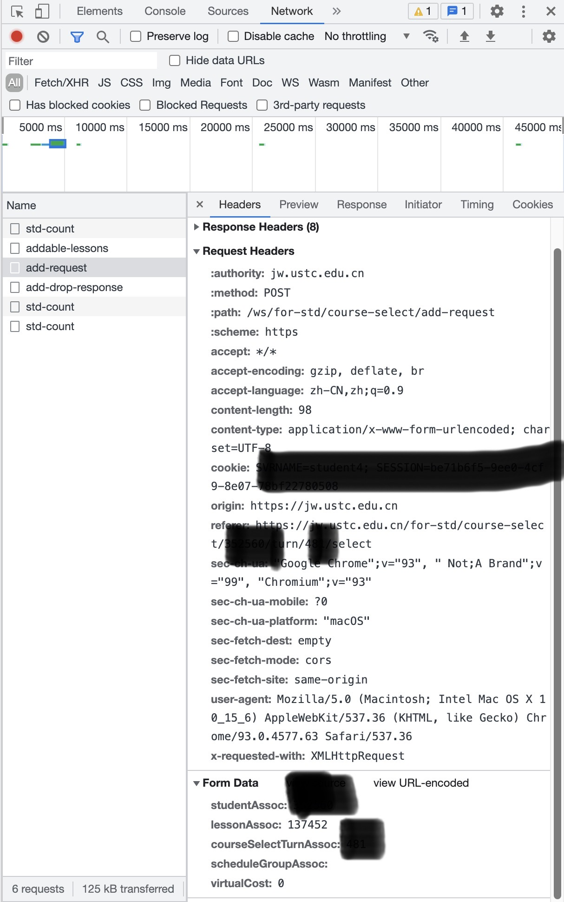

# USTC选课脚本丐版
选课脚本丐版，仅作学习交流之用途，如发生事故一切与本人无关。

### 准备工作
首先用谷歌浏览器打开选课界面，打开开发者工具，点击NetWork，可以看到在这个页面上发起的请求的网络包。
随便点击一个选课按钮，可以看到如下：

Request Headers就是调用选课接口发送的请求头，Form Data就是请求的参数。对应填入脚本文件中即可。add-drop-response同理。
### 脚本使用
推荐使用Python虚拟环境。
```python
python3 -m venv venv
source ./venv/bin/activate
pip install requests
# pip install time
```
`Ctrl+d`可退出虚拟环境，如果不需要的话直接`rm -r venv`删除即可。
